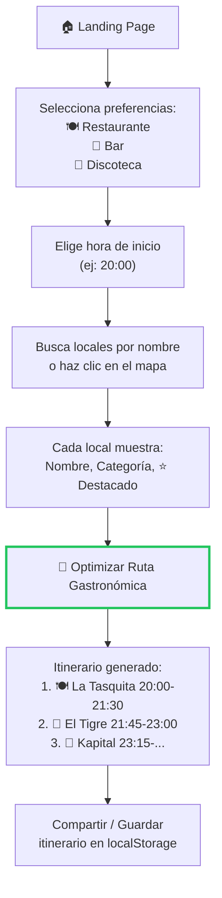
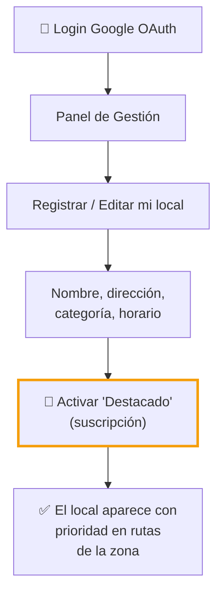
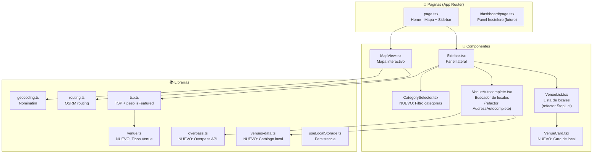
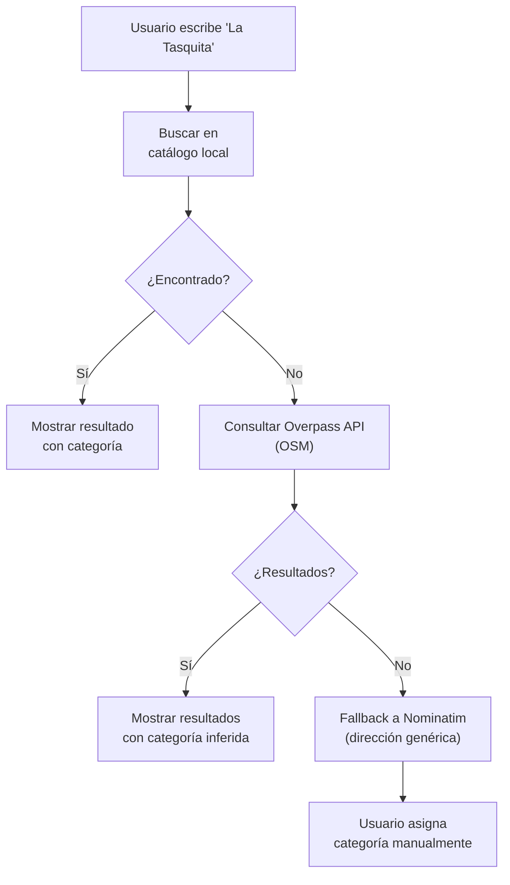
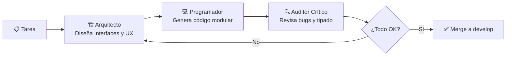
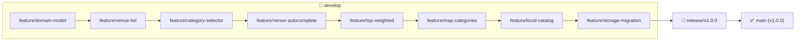
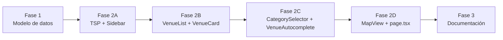

# PLAN MAESTRO: RouteWise → App de Ocio y Gastronomía (B2B2C)

> **Versión:** 1.0  
> **Fecha:** 2026-05-18  
> **Modo:** Arquitecto  
> **Siguiente paso:** Implementación en modo Code

---

## Índice

1. [Definición de Producto (40%)](#1-definición-de-producto-40)
2. [Arquitectura Técnica (40%)](#2-arquitectura-técnica-40)
3. [Integración de IA (20%)](#3-integración-de-ia-20)
4. [Organización GitHub](#4-organización-github)
5. [Plan de Implementación](#5-plan-de-implementación)

---

## 1. DEFINICIÓN DE PRODUCTO (40%)

### 1.1 Visión

**RouteWise** es una plataforma web interactiva que elimina la *fatiga de decisión* del turista. En lugar de saltar entre Google Maps, TripAdvisor y Google para planificar una salida nocturna, el turista selecciona sus preferencias y la app genera un **itinerario inteligente y optimizado** en un mapa, combinando restaurantes, bares y discotecas en la ruta más eficiente mediante algoritmos TSP.

### 1.2 Modelo de Negocio (B2B2C)

- **B2C (Turista):** App gratuita. Genera rutas de ocio personalizadas.
- **B2B (Hostelero):** Suscripción "Destacado" para aparecer con prioridad en las rutas. El algoritmo TSP aplica un peso reducido a los locales destacados, haciendo que sean seleccionados antes en la ruta óptima.

### 1.3 User Personas

| Persona | Problema | Solución RouteWise |
|---|---|---|
| **Turista** (18-40 años) | "No sé por dónde empezar. ¿Dónde cenar, luego copas, luego discoteca? Tengo que mirar 3 apps distintas." | Un solo clic → ruta completa optimizada con hora estimada de llegada a cada local. |
| **Hostelero** (dueño de restaurante/bar/discoteca) | "Mi local está en una zona turística pero no destaco frente a la competencia." | Suscripción mensual para aparecer como "Destacado" con prioridad en las rutas generadas cerca de su local. |

### 1.4 User Flow (Turista)



### 1.5 User Flow (Hostelero — Futuro)



### 1.6 Modelo de Datos

#### Archivo: `src/lib/venue.ts`

```typescript
// === Tipos base (compartidos con tsp.ts) ===
export type Coordinate = { lat: number; lng: number };

export interface TimeWindow {
  estimatedArrival?: string;  // HH:MM - calculado tras optimizar
  deadline?: string;          // HH:MM - límite fijado por el usuario
}

// === Categorías de ocio ===
export type VenueCategory = "restaurant" | "bar" | "nightclub";

export const VENUE_CATEGORY_LABELS: Record<VenueCategory, string> = {
  restaurant: "Restaurante",
  bar: "Bar",
  nightclub: "Discoteca",
};

export const VENUE_CATEGORY_ICONS: Record<VenueCategory, string> = {
  restaurant: "🍽️",
  bar: "🍺",
  nightclub: "🪩",
};

export const VENUE_CATEGORY_COLORS: Record<VenueCategory, string> = {
  restaurant: "#22c55e",  // verde
  bar: "#3b82f6",         // azul
  nightclub: "#a855f7",   // púrpura
};

// === Local comercial ===
export interface Venue {
  id: string;
  name: string;
  address: string;
  coordinates: Coordinate;
  category: VenueCategory;
  isFeatured: boolean;       // Destacado (B2B)
  timeWindow?: TimeWindow;
}

// === Preferencias del turista ===
export interface UserPreferences {
  categories: VenueCategory[];  // Filtros activos
  startTime: string;            // "20:00"
}

// === Itinerario generado ===
export interface Itinerary {
  id: string;
  venues: Venue[];
  totalDistance: number;        // km
  totalDuration: number;        // segundos
  geometry: Coordinate[];
  createdAt: string;
}
```

---

## 2. ARQUITECTURA TÉCNICA (40%)

### 2.1 Stack Tecnológico

| Tecnología | Versión | Propósito | Justificación |
|---|---|---|---|
| **Next.js 14** (App Router) | 14.2.35 | Framework frontend | SSR/SSG, routing basado en archivos, ya configurado |
| **TypeScript** | 5.x | Lenguaje | Tipado estricto (`strict: true`), ya configurado |
| **Tailwind CSS** | 3.4 | Estilos | Utility-first, ya integrado con Shadcn |
| **Shadcn/ui** | latest | Componentes UI | Headless + estilizados (Card, Badge, Button, ScrollArea) |
| **MapLibre GL** | 5.24 | Mapas vectoriales | **Gratuito**, sin API key, vector tiles rápidos |
| **OSRM** | — | Routing por carretera | **Gratuito**, self-hostable, API REST simple |
| **Nominatim** | — | Geocoding | **Gratuito** (OpenStreetMap), 1 req/s |
| **Overpass API** | — | Búsqueda de locales | **Gratuito** (OSM), busca por nombre y categoría |
| **TSP Algorithm** | propio | Optimización de rutas | Nearest Neighbor + 2-opt, O(n²), sin dependencias |
| **Catálogo local** | JSON | Datos de ejemplo | 15 locales ficticios en Madrid para demo offline |

### 2.2 Arquitectura de Componentes



### 2.3 Decisiones Técnicas Justificadas

| Decisión | Alternativa descartada | Por qué esta opción |
|---|---|---|
| **TSP con Nearest Neighbor + 2-opt** | Google OR-Tools, algoritmo genético | Sin dependencias externas, O(n²) aceptable para <50 venues |
| **MapLibre GL** (vector tiles) | Google Maps API, Leaflet | **Gratuito 100%**, sin API key |
| **OSRM para routing** | Google Directions API | Gratuito, self-hostable |
| **Nominatim para geocoding** | Google Geocoding API | Gratuito |
| **Overpass para búsqueda de locales** | Google Places API | Gratuito, datos estructurados de OSM |
| **Catálogo local + Overpass** | Solo Overpass | Demo funciona offline, fallback si Overpass falla |
| **LocalStorage** | IndexedDB, Zustand | Simple, suficiente para MVP |
| **Shadcn/ui** | Material UI, Chakra UI | Bundle pequeño, Tailwind nativo |
| **Sin BD en MVP** | PostgreSQL, Supabase | 100% client-side hasta fase B2B |

### 2.4 Algoritmo TSP con Peso de Destacados

El corazón matemático se modifica para dar prioridad a locales con `isFeatured = true`:

```typescript
// src/lib/tsp.ts

export interface TSPConfig {
  featuredWeight: number;  // 0.7 = 30% descuento en distancia
}

const DEFAULT_CONFIG: TSPConfig = { featuredWeight: 0.7 };

function weightedDistance(from: Venue, to: Venue, config: TSPConfig): number {
  const baseDist = haversineDistance(from.coordinates, to.coordinates);
  if (to.isFeatured) {
    return baseDist * config.featuredWeight;
  }
  return baseDist;
}
```

**Efecto:** Un local destacado a 2.5 km se comporta como si estuviera a 1.75 km, haciendo que el TSP lo prefiera sobre uno no destacado a 2.0 km.

### 2.5 Búsqueda de Locales (Catálogo Local + Overpass)

Estrategia en 2 capas:



### 2.6 Migración de localStorage

El cambio de `Stop` → `Venue` es rompedor. Estrategia:

```typescript
// En page.tsx
const STORAGE_VERSION = 2;

function migrateStorage(): void {
  const version = localStorage.getItem("routewise-schema-version");
  if (version === null || Number(version) < STORAGE_VERSION) {
    // Limpiar datos del schema anterior (Stop)
    localStorage.removeItem("routewise-stops");
    localStorage.removeItem("routewise-optimized");
    localStorage.removeItem("routewise-geometry");
    localStorage.removeItem("routewise-isOptimized");
    localStorage.setItem("routewise-schema-version", String(STORAGE_VERSION));
  }
}
```

### 2.7 Estructura de Archivos Final

```
src/
├── app/
│   ├── layout.tsx                    # Metadata actualizada
│   ├── page.tsx                      # Home refactorizado (Venue)
│   ├── globals.css                   # Sin cambios
│   └── fonts/
├── components/
│   ├── Sidebar.tsx                   # Refactorizado: Stop → Venue
│   ├── VenueList.tsx                 # Renombrado desde StopList.tsx
│   ├── MapView.tsx                   # Actualizado: colores por categoría
│   ├── VenueAutocomplete.tsx         # Refactorizado desde AddressAutocomplete
│   ├── CategorySelector.tsx          # NUEVO
│   ├── VenueCard.tsx                 # NUEVO
│   └── ui/                           # Shadcn (sin cambios)
├── lib/
│   ├── tsp.ts                        # MODIFICADO: peso isFeatured
│   ├── routing.ts                    # SIN CAMBIOS
│   ├── geocoding.ts                  # SIN CAMBIOS
│   ├── venue.ts                      # NUEVO
│   ├── venues-data.ts                # NUEVO: catálogo local
│   ├── overpass.ts                   # NUEVO: Overpass API
│   ├── useLocalStorage.ts            # SIN CAMBIOS
│   └── utils.ts                      # SIN CAMBIOS
```

---

## 3. INTEGRACIÓN DE IA (20%)

### 3.1 Flujo Multi-Agente

Cada tarea de desarrollo sigue este proceso, documentado en el chat:



### 3.2 Checklist de Validación del Auditor

| # | Check | Descripción |
|---|---|---|
| 1 | ✅ `'use client'` | Componentes interactivos tienen la directiva correcta |
| 2 | ✅ TypeScript strict | Sin `any`, sin `@ts-ignore`, tipos exportados |
| 3 | ✅ Shadcn imports | Importaciones desde `@/components/ui/` |
| 4 | ✅ Tailwind classes | Sin clases inline de estilo raw |
| 5 | ✅ TSP intacto | El algoritmo base no se rompe, solo se añade peso |
| 6 | ✅ localStorage migration | Datos antiguos no rompen la app |
| 7 | ✅ MapLibre compat | Coordenadas en formato `[lng, lat]` |
| 8 | ✅ Overpass rate limit | 1 req/s, con debounce |
| 9 | ✅ Responsive | Sidebar funciona en desktop y mobile |
| 10 | ✅ Sin API keys hardcodeadas | Claves en `.env.local` si se usan |

### 3.3 Template de Prompt para cada Tarea

```
## Tarea: [nombre]
## Rol: [Arquitecto | Programador | Auditor]

### Contexto
- Proyecto: RouteWise (App de Ocio/Gastronomía)
- Stack: Next.js 14, TypeScript, Tailwind, Shadcn, MapLibre
- Archivos relevantes: [lista]

### Requisitos
[lista de requisitos]

### Restricciones
- TypeScript strict mode
- No modificar routing.ts ni geocoding.ts
- Reutilizar componentes Shadcn existentes (Card, Badge, Button, ScrollArea)
- Coordenadas en formato [lng, lat] para MapLibre
- Overpass API con debounce de 300ms
```

---

## 4. ORGANIZACIÓN GITHUB

### 4.1 Estructura de Branches

```
main                        # Producción (protegida)
├── develop                 # Integración continua
│   ├── feature/domain-model          # venue.ts + tipos
│   ├── feature/venue-list            # VenueList + VenueCard
│   ├── feature/category-selector     # CategorySelector
│   ├── feature/venue-autocomplete    # VenueAutocomplete + Overpass
│   ├── feature/tsp-weighted          # Peso isFeatured en TSP
│   ├── feature/map-categories        # Colores por categoría en mapa
│   ├── feature/local-catalog         # Catálogo local de ejemplo
│   ├── feature/storage-migration     # Migración localStorage
│   └── feature/readme-update         # Documentación
├── release/v1.0.0
└── hotfix/*
```

### 4.2 Flujo de Trabajo



### 4.3 Convención de Commits

Formato: `[#issue] - Verbo [scope]: mensaje`

```
[#1] - Crear Venue type y VenueCategory enum
[#2] - Crear VenueList y VenueCard components
[#3] - Añadir CategorySelector con restaurant/bar/nightclub
[#4] - Implementar VenueAutocomplete con Overpass API
[#5] - Añadir weighted distance para featured venues en TSP
[#6] - Colorear marcadores del mapa por categoría de venue
[#7] - Añadir catálogo local de venues para demo
[#8] - Migrar localStorage de Stop a Venue schema
[#9] - Actualizar README con descripción de gastro/leisure app
```

---

## 5. PLAN DE IMPLEMENTACIÓN

### Fase 1: Modelo de Datos y Tipos

| # | Tarea | Archivos | Dependencias |
|---|---|---|---|
| 1.1 | Crear `venue.ts` con tipos del dominio | `src/lib/venue.ts` (nuevo) | — |
| 1.2 | Crear `venues-data.ts` con catálogo local | `src/lib/venues-data.ts` (nuevo) | 1.1 |
| 1.3 | Crear `overpass.ts` con cliente Overpass API | `src/lib/overpass.ts` (nuevo) | 1.1 |

### Fase 2: Refactor de Componentes

| # | Tarea | Archivos | Dependencias |
|---|---|---|---|
| 2.1 | Refactor `tsp.ts`: añadir `weightedDistance` y `TSPConfig` | `src/lib/tsp.ts` | 1.1 |
| 2.2 | Refactor `Sidebar.tsx`: `Stop` → `Venue` | `src/components/Sidebar.tsx` | 1.1, 2.1 |
| 2.3 | Renombrar `StopList.tsx` → `VenueList.tsx` con categorías | `src/components/VenueList.tsx` | 1.1 |
| 2.4 | Crear `VenueCard.tsx` con badge `isFeatured` | `src/components/VenueCard.tsx` | 1.1 |
| 2.5 | Crear `CategorySelector.tsx` | `src/components/CategorySelector.tsx` | 1.1 |
| 2.6 | Refactor `AddressAutocomplete` → `VenueAutocomplete` | `src/components/VenueAutocomplete.tsx` | 1.1, 1.2, 1.3 |
| 2.7 | Refactor `MapView.tsx`: colores por categoría | `src/components/MapView.tsx` | 1.1 |
| 2.8 | Refactor `page.tsx`: migración localStorage + tipos | `src/app/page.tsx` | 1.1, 2.2 |

### Fase 3: Pulido y Documentación

| # | Tarea | Archivos | Dependencias |
|---|---|---|---|
| 3.1 | Actualizar `layout.tsx` metadata | `src/app/layout.tsx` | — |
| 3.2 | Actualizar `README.md` | `README.md` | — |
| 3.3 | Verificar build y lint | — | Todas |

### Orden de Implementación Recomendado



---

## RESUMEN DE ARCHIVOS A MODIFICAR/CREAR

| Acción | Archivo | Descripción |
|---|---|---|
| **CREAR** | `src/lib/venue.ts` | Tipos del dominio (Venue, VenueCategory, etc.) |
| **CREAR** | `src/lib/venues-data.ts` | Catálogo local de 15 locales de ejemplo |
| **CREAR** | `src/lib/overpass.ts` | Cliente Overpass API para búsqueda de locales |
| **CREAR** | `src/components/CategorySelector.tsx` | Selector de categorías (Restaurante/Bar/Discoteca) |
| **CREAR** | `src/components/VenueCard.tsx` | Card individual de local con badge destacado |
| **MODIFICAR** | `src/lib/tsp.ts` | Añadir `weightedDistance` y `TSPConfig` |
| **RENOMBRAR** | `src/components/StopList.tsx` → `VenueList.tsx` | Refactor con categorías |
| **RENOMBRAR** | `src/components/AddressAutocomplete.tsx` → `VenueAutocomplete.tsx` | Búsqueda de locales |
| **MODIFICAR** | `src/components/Sidebar.tsx` | `Stop` → `Venue`, añadir CategorySelector |
| **MODIFICAR** | `src/components/MapView.tsx` | Colores por categoría, popups con iconos |
| **MODIFICAR** | `src/app/page.tsx` | Migración localStorage, tipos Venue |
| **MODIFICAR** | `src/app/layout.tsx` | Metadata actualizada |
| **MODIFICAR** | `README.md` | Documentación del proyecto |
